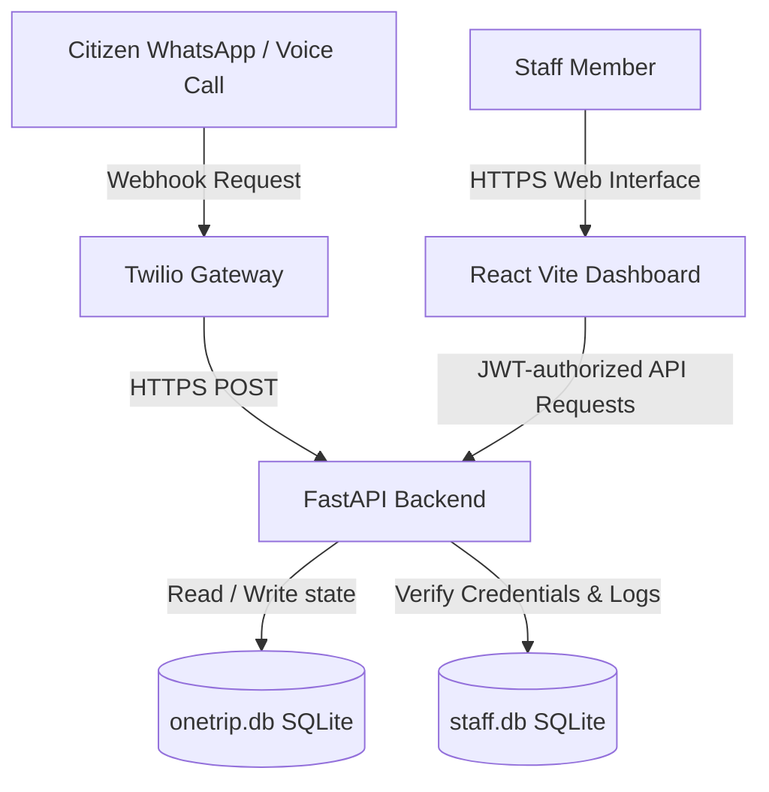

# OneTrip

OneTrip is a secure administrative system designed to prevent citizens from making unnecessary physical trips to government offices. It verifies document requirements with citizens through Twilio-powered messaging and voice automated flows prior to issuing appointment tokens. Government staff manage, monitor, and resolve these appointments through a React dashboard built with fine-grained access control.

---

## Architecture and System Flow

The application is split into a FastAPI backend and a React single-page frontend. Data persistence is managed using two isolated SQLite databases: one for citizen/appointment data and another for staff accounts and audit logging.



### System Sequence Flow

1. The citizen initiates contact via WhatsApp or voice.
2. Twilio triggers the corresponding FastAPI webhook.
3. The backend processes the conversation state machine, updating the citizen record (location, selected service).
4. The backend returns a TwiML response instructing Twilio on what to say or message back.
5. Once the citizen confirms all required documents are ready, the backend generates a secure appointment token (e.g. T-GAKJ3) and persists the appointment.
6. Government staff log in to the dashboard to monitor queue counts and mark visits as completed.

---

## Directory Structure

```text
Onetrip/
├── README.md               - Root project documentation and setup instructions
├── render.yaml             - Infrastructure-as-code configuration for Render deployment
├── database/
│   ├── onetrip.db          - SQLite database for citizen information and appointments
│   └── staff.db            - SQLite database for staff accounts and audit records
├── backend/
│   ├── main.py             - FastAPI entrypoint, HTTP API endpoints, and middleware
│   ├── bot.py              - Text and voice bot state machine logic
│   ├── security.py         - Custom JWT creation, verification, and PBKDF2 hashing functions
│   ├── models.py           - SQLAlchemy models for citizens, services, and appointments
│   ├── models_staff.py     - SQLAlchemy models for staff accounts and audit logs
│   ├── database.py         - Citizen database connection and session management
│   ├── database_staff.py   - Staff database connection and session management
│   ├── test_simulator.py   - Local test simulation utility for WhatsApp conversation flows
│   └── requirements.txt    - Backend package dependencies
└── frontend/
    ├── src/
    │   ├── main.jsx        - React frontend entry point
    │   ├── App.jsx         - Router definition (login, dashboard)
    │   ├── api.js          - Backend API URL selection helper
    │   ├── index.css       - Core stylesheets
    │   └── pages/
    │       ├── Login.jsx   - Password rotation and login portal
    │       └── DashboardLayout.jsx - Multi-role staff dashboard layout
    └── package.json        - Node dependencies and scripts
```

---

## API Reference

### Public Endpoints

* `GET /` - API Health check. Returns active status.
* `POST /seed` - Seeds default government services and the SuperAdmin account. Enabled only in development or with explicit environment flag.
* `POST /api/staff/login` - Staff login endpoint. Generates a signed JWT access token. Gated by IP rate-limiting.
* `POST /api/webhook/twilio` - Twilio webhook for WhatsApp/SMS messages. Protected by signature validation.
* `POST /api/webhook/twilio-voice` - Twilio webhook for voice IVR calls. Protected by signature validation.

### Protected Endpoints (Requires valid JWT Bearer Token)

* `POST /api/staff/change-password` - Changes password for the currently authenticated staff member. Used for forced credential rotation.
* `GET /api/dashboard/appointments` - Returns appointments. Default behavior filters for the current day's (UTC) appointments. Supports `all=true` parameter, pagination (`limit` and `offset`), and filters results based on staff office location.
* `PUT /api/dashboard/appointments/{appointment_id}/complete` - Resolves a pending appointment. Restricts officers to their assigned location and logs action to audit table.
* `GET /api/dashboard/citizens` - Returns citizen records. Restricts results by location for officers. Supports pagination.
* `GET /api/dashboard/services` - Returns service specifications and required document lists.

---

## Security Implementations

This system implements several checks to ensure it is secure for public internet deployments:

### 1. Gated Seeding and Credential Rotation
- The `/seed` endpoint raises an HTTP 403 error unless the environment variable `ALLOW_SEED` is set to `true`.
- Seeding generates a secure, randomized temporary password for the admin account if no `SEED_ADMIN_PASSWORD` is supplied. The account is flagged with `password_change_required = True`.
- Restricted JWT tokens are issued during initial login with temporary passwords, allowing only password modification via `/api/staff/change-password` and blocking dashboard views.

### 2. Role-Based Access Control (RBAC) and Data Isolation
- Three user roles are defined:
  - `SuperAdmin` - Complete read and write access across all office locations.
  - `Officer` - Access is isolated to their specific office. They can only view appointments/citizens matching their office location, and can only complete appointments for their location.
  - `Viewer` - Read-only access to dashboard data. Mutating actions are blocked.
- Access restrictions are verified on the backend by inspecting claims within the cryptographically verified JWT payload.

### 3. Twilio Webhook Signature Verification
- Inbound webhooks check the `X-Twilio-Signature` header against the `TWILIO_AUTH_TOKEN` environment variable.
- The validator handles reverse-proxy configurations by parsing `X-Forwarded-Proto` and `X-Forwarded-Host` headers to reconstruct the original request URL accurately.

### 4. Rate Limiting and Audit Logs
- The `/api/staff/login` endpoint blocks requests if more than 5 attempts originate from the same IP address in a 60-second window.
- All high-privilege activities, login successes, login failures, password changes, and appointment completions are recorded in the `audit_logs` table in `staff.db`.

---

## Local Setup Instructions

### Backend Configuration

1. Navigate to the backend directory:
   ```bash
   cd backend
   ```
2. Create and activate a Python virtual environment:
   ```bash
   python -m venv venv
   # On Windows (PowerShell):
   .\venv\Scripts\Activate.ps1
   # On Linux/macOS:
   source venv/bin/activate
   ```
3. Install package dependencies:
   ```bash
   pip install -r requirements.txt
   ```
4. Define your environment variables (optional for local mock testing, required for Twilio/production deployment):
   ```bash
   # On Windows (PowerShell):
   $env:ALLOW_SEED="true"
   $env:SEED_ADMIN_PASSWORD="customsecurepassword"
   $env:TWILIO_AUTH_TOKEN="your_twilio_auth_token"
   # On Linux/macOS:
   export ALLOW_SEED="true"
   export SEED_ADMIN_PASSWORD="customsecurepassword"
   export TWILIO_AUTH_TOKEN="your_twilio_auth_token"
   ```
5. Start the FastAPI development server:
   ```bash
   python -m uvicorn main:app --reload --port 8000
   ```

### Frontend Configuration

1. Navigate to the frontend directory:
   ```bash
   cd ../frontend
   ```
2. Install Node dependencies:
   ```bash
   npm install
   ```
3. Create a `.env` file in the frontend folder if local API proxying configuration is desired, specifying:
   ```text
   VITE_API_URL=http://localhost:8000
   ```
4. Start the frontend Vite development server:
   ```bash
   npm run dev
   ```

### Conversation Simulator

To test the bot state machine logic locally without configuring real Twilio integrations:
1. Ensure the backend server is running on `http://localhost:8000`.
2. Open a separate terminal, navigate to the `backend/` directory, activate the virtual environment, and execute:
   ```bash
   python test_simulator.py
   ```
   This script triggers mock WhatsApp webhook events sequentially to verify the citizen onboarding, document checking, and token issuance workflows.
